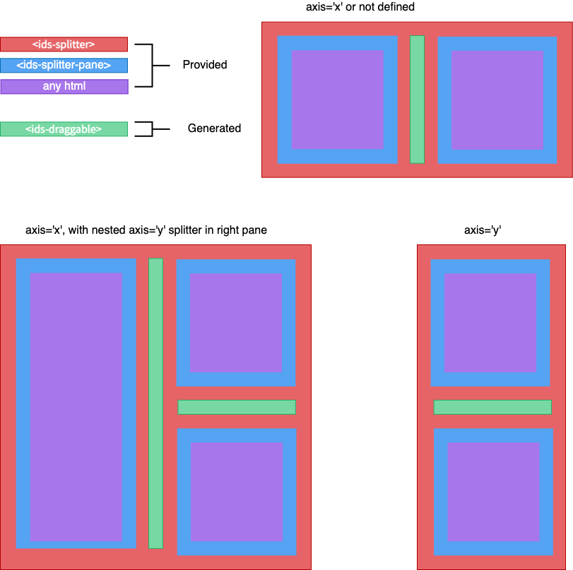

# Ids Splitter Component

The Ids Splitter is used to divide the user interface of a page. It is composed of resizable "panes" which divide content. It can layout either horizontally or vertically along an axis where a user can resize the panes, these are represented as `<ids-splitter-pane>` components.



The pane can move to the left or the right of the screen. This allows the user to have control of the customized layout. Elements inside and outside the pane will be resized to fit depending on if their css is fluid.

## Use Cases

- Divides the user interface of a screen.

## Terminology

- **Splitter**: The splitter container element
- **SplitterPane**: One zone/section inside the splitter
- **SplitBar**: The generated bar element to drag panes to resize

## Features (With Code Examples)

A default splitter behavior, axis will set to "x" (horizontally) and align will set to "start".

```html
<ids-splitter>
  <ids-splitter-pane></ids-splitter-pane>
  <ids-splitter-pane></ids-splitter-pane>
</ids-splitter>
```

Splitter align set to end.

```html
<ids-splitter align="end">
  <ids-splitter-pane></ids-splitter-pane>
  <ids-splitter-pane></ids-splitter-pane>
</ids-splitter>
```

Splitter set to initial size 30%.

```html
<ids-splitter>
  <ids-splitter-pane size="30%"></ids-splitter-pane>
  <ids-splitter-pane></ids-splitter-pane>
</ids-splitter>
```

Splitter set to minimum size of 10% to be resize.

```html
<ids-splitter>
  <ids-splitter-pane min-size="10%"></ids-splitter-pane>
  <ids-splitter-pane></ids-splitter-pane>
</ids-splitter>
```

Splitter set to maximum size of 80% to be resize, limited to single split only.

```html
<ids-splitter>
  <ids-splitter-pane max-size="80%"></ids-splitter-pane>
  <ids-splitter-pane></ids-splitter-pane>
</ids-splitter>
```

Splitter set to initial collapsed pane. Collapsed can only apply to start pane.

```html
<ids-splitter>
  <ids-splitter-pane collapsed></ids-splitter-pane>
  <ids-splitter-pane></ids-splitter-pane>
</ids-splitter>
```

Splitter with multiple splits.

```html
<ids-splitter>
  <ids-splitter-pane></ids-splitter-pane>
  <ids-splitter-pane></ids-splitter-pane>
  <ids-splitter-pane></ids-splitter-pane>
  <ids-splitter-pane></ids-splitter-pane>
</ids-splitter>
```

Splitter set as vertically.

```html
<ids-splitter axis="y">
  <ids-splitter-pane></ids-splitter-pane>
  <ids-splitter-pane></ids-splitter-pane>
</ids-splitter>
```

Splitter set to nested (horizontally and vertically).

```html
<ids-splitter>
  <ids-splitter-pane></ids-splitter-pane>
  <ids-splitter-pane>
    <ids-splitter axis="y">
      <ids-splitter-pane></ids-splitter-pane>
      <ids-splitter-pane></ids-splitter-pane>
    </ids-splitter>
  </ids-splitter-pane>
</ids-splitter>
```

Splitter with custom (aria-label) for draggable bar/s.

```html
<ids-splitter label="Custom Resize Text">
  <ids-splitter-pane></ids-splitter-pane>
  <ids-splitter-pane></ids-splitter-pane>
</ids-splitter>
```

Splitter to do the resize after drag-end.

```html
<ids-splitter resize-on-drag-end>
  <ids-splitter-pane></ids-splitter-pane>
  <ids-splitter-pane></ids-splitter-pane>
</ids-splitter>
```

Splitter set as disabled.

```html
<ids-splitter disabled>
  <ids-splitter-pane></ids-splitter-pane>
  <ids-splitter-pane></ids-splitter-pane>
</ids-splitter>
```

## Settings and Attributes (Splitter)

- `align` {string} Set the split bar align direction to start or end
- `axis` {string} Set the splitter axis direction x: horizontal or y: vertical
- `disabled` {boolean} Sets the splitter to disabled state
- `label` {string} Set the aria-label text for each split bar
- `resizeOnDragEnd` {boolean} Sets the splitter to resize on drag end

## Settings and Attributes (Splitter Pane)

- `size` {string|number} Sets initially the pane size
- `minSize` {string|number} Sets initially the pane minimum size
- `maxSize` {string|number} Sets initially the pane maximum size
- `collapsed` {boolean} Sets initially the pane to collapsed state

## Theme-able Parts (Splitter)

- `splitter` allows you to further style the splitter element
- `split-bar` allows you to further style the split bar element
- `split-bar-icon` allows you to further style the split bar icon element

## Theme-able Parts (Splitter Pane)

- `pane` allows you to further style the splitter pane element

## Events (Splitter)

- `beforecollapsed` Fires before the splitter pane get collapsed, you can return false in the response to veto
- `collapsed` Fires after the splitter pane get collapsed
- `beforeexpanded` Fires before the splitter pane get expanded, you can return false in the response to veto
- `expanded` Fires after the splitter pane get expanded
- `beforesizechanged` Fires before the splitter pane size changed, you can return false in the response to veto
- `sizechanged` Fires after the splitter pane size changed

## Methods (Splitter)

- `collapse(options: { startPane: HTMLElement|string, endPane: HTMLElement|string }): void` Collapse start pane size for given start/end panes or panes CSS selector
- `expand(options: { startPane: HTMLElement|string, endPane: HTMLElement|string }): void` Expand start pane size for given start/end panes or panes CSS selector
- `getPair(options: { startPane: HTMLElement|string, endPane: HTMLElement|string }): object` Get a splitter pair by given start/end panes or panes CSS selector
- `isHorizontal(): boolean` Get true if current orientation is horizontal
- `sizes(): Array<number>` Get list of current sizes
- `minSizes(): Array<number>` Get list of current minimum sizes
- `maxSizes(): Array<number>` Get list of current maximum sizes, limited to single split

## States and Variations (With Code Examples)

- Horizontal: Ability to display horizontal split content
- Vertical: Ability to display vertical split content
- Multiple: Splitter with multiple splits
- Nested: Splitter nested with another splitter (horizontally and/or vertically)
- Disabled: split-bar/s cannot be clicked, hovered, focused or dragged and not visible

## Keyboard Guidelines

- <kbd>Tab/Shift + Tab</kbd>: This will focus or unfocus the split-bar/s.
- <kbd>Down/Left Arrow</kbd>: Resize and moves the focused split-bar to left on horizontal, or bottom on vertical splitter.
- <kbd>Up/Right Arrow</kbd>: Resize and moves the focused split-bar to right on horizontal, or top on vertical splitter.

## Responsive Guidelines

- Flows with padding and margin within the width and height of the parent container.

## Converting from Previous Versions

- 3.x: Splitter have all new markup and classes.
- 4.x: Splitter have all new markup and classes for web components.

## Designs

[Design Specs](https://www.figma.com/file/ri2Knf3KchdfdzRAeds0Ab/IDS-Mobility-v4.6?node-id=1%3A5740)

## Accessibility Guidelines

- Splitter component contained in the element has a `role="group"`.
- Each pane element if `id` attribute not provided will add component generated default id to use with split-bar for reference.
- Each split-bar element contains `role="separator"`.
- Each split-bar element contains `aria-label"`, if `label` not provided will use component generated default text.
- Each split-bar element contains its current state with a `horizontal` or `vertical` value as `aria-orientation`.
- Each split-bar element contains `aria-controls` with value `{start-pane-id}` and `{end-pane-id}`.
- Each split-bar element contains its current state with a `boolean` value as `aria-disabled`.

## Regional Considerations

In Right To Left Languages the icons, text and alignment will flow to the other side. Labels should be localized in the current language.
