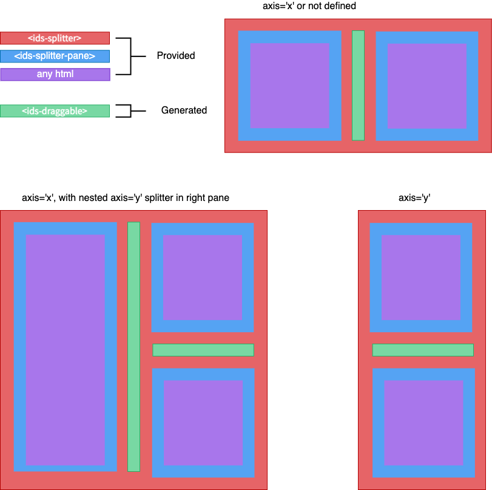

# Ids Splitter Component

The Ids Splitter is used to divides the user interface of a screen. It is composed of resizable "panes" which divide content laid out either horizontally or vertically
along an axis where a user can resize the panes, these are represented as `<ids-splitter-pane>` components.



The pane can move to the left or the right of the screen. This allows the user to have control of the customized layout. Elements inside and outside the pane will be resized to fit.

## Use Cases

- Divides the user interface of a screen.

## Terminology

- **Splitter**: The splitter container element
- **Splitter Pane**: One zone/section inside the splitter
- **Draggable/Drag Hander**: The generate element to drag

## Features (With Code Examples)

Axis will act as "x"/Horizontal with none set (default behavior).

```html
<ids-splitter>
  <ids-splitter-pane>
    Horizontally on Left
  </ids-splitter-pane>
  <ids-splitter-pane>
    Horizontally on the Right
  </ids-splitter-pane>
</ids-splitter>
```

Vertical Splitter with the bottom pane limited to height of 40%.

```html
<ids-splitter axis="y">
  <ids-splitter-pane>
    Horizontally on Left
  </ids-splitter-pane>
  <ids-splitter-pane max-size="40%">
   Content on the right
  </ids-splitter-pane>
</ids-splitter>
```

Nested Pane Content

```html
<ids-splitter axis="x">
  <ids-splitter-pane min-size="30%" max-size="50%" size="25%">
    H1
  </ids-splitter-pane>
  <ids-splitter-pane>
    <ids-splitter axis="y">
      <ids-splitter-pane min-size="20%" size="20%">
        H2/V1 (20% of height for content)
      </ids-splitter-pane>
      <ids-splitter-pane>
        H2/V2
      </ids-splitter-pane>
    </ids-splitter>
  </ids-splitter-pane>
</ids-splitter>
```

