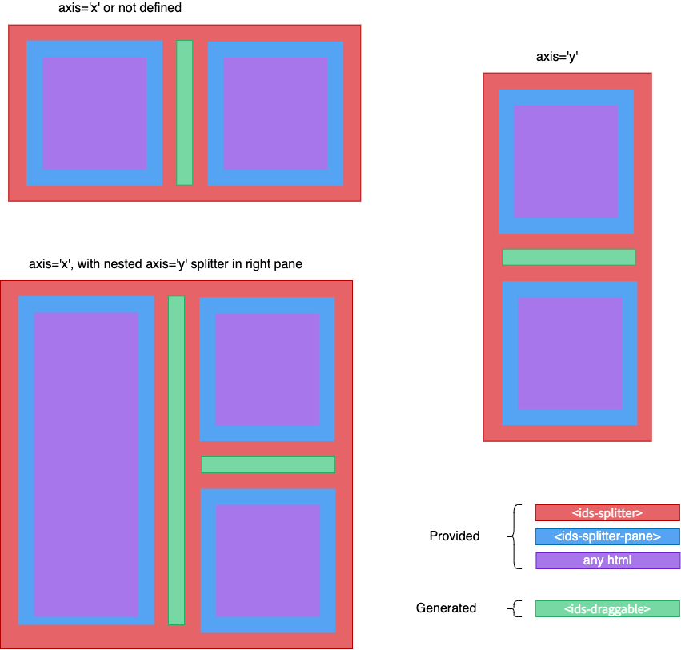

# Ids Splitter Component

The Ids Splitter is composed of resizable "panes" which divide content laid out either horizontally or vertically
along an axis where a user can resize the panes (represented as `<ids-splitter-pane>` components).\



## Use Cases

A splitter can be used for a section table of contents, a set of widgets that may be resizable, and other cases
where the point that content is split along can be resized.

## Examples

*Default behavior; Axis will act as "x"/Horizontal with none set*

```html
<ids-splitter>
  <ids-splitter-pane>
    Horizontally on Left
  </ids-splitter-pane>
  <ids-splitter-pane>
    Horizontally on the Right
  </ids-splitter-pane>
</ids-splitter>
```

*Vertical Splitter with the bottom pane limited to height of 40%*
```html
<ids-splitter axis="y">
  <ids-splitter-pane>
    Horizontally on Left
  </ids-splitter-pane>
  <ids-splitter-pane max-size="40%">
   Content on the right
  </ids-splitter-pane>
</ids-splitter>
```

*Nested Pane Content*
```html
<ids-splitter axis="x">
  <ids-splitter-pane min-size="30%" max-size="50%" size="25%">
    H1
  </ids-splitter-pane>
  <ids-splitter-pane>
    <ids-splitter axis="y">
      <ids-splitter-pane min-size="20%" size="20%">
        H2/V1 (20% of height for content)
      </ids-splitter-pane>
      <ids-splitter-pane>
        H2/V2
      </ids-splitter-pane>
    </ids-splitter>
  </ids-splitter-pane>
</ids-splitter>
```